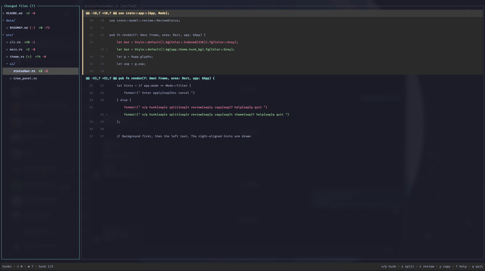

# hunkr

A fast, terminal-first **git diff reviewer built for AI coding workflows**. When an agent
edits your code, `hunkr` lets you review the changes file-by-file and chunk-by-chunk, mark
what you've checked, and copy an AI-ready reference back to the agent — without leaving the
terminal or opening an IDE.

It is **not** a git client: no commit, push, PR, or merge. Just review.



## The loop

1. The AI edits files.
2. `hunkr` auto-refreshes the diff (filesystem watch + off-thread git).
3. You review file-by-file / chunk-by-chunk.
4. Mark files reviewed (`r`). Reviewed state is tied to the file's diff hash, so if the
   file changes again it automatically falls back to unreviewed.
5. Press `y` to copy an AI-ready reference for the current chunk and paste it back to the
   agent.
6. Repeat — never leaving the terminal.

## Install

```sh
cargo install --git https://github.com/plovinicius/hunkr   # install the `hunkr` binary
```

Or build from a clone:

```sh
git clone https://github.com/plovinicius/hunkr
cd hunkr
cargo install --path .
```

## Run

```sh
hunkr                      # review the repo in the current directory
hunkr PATH                 # review the repo containing PATH
hunkr --ascii              # force ASCII icons ([x] [ ] v >) instead of Unicode
```

During development you can use `cargo run -- …` in place of the installed binary.

Icons are Unicode by default (`✓` reviewed, `●` unreviewed, `▸`/`▾` folders); pass
`--ascii` for a plain-text set (`[x]`, `[ ]`, `>`/`v`) if your terminal/font mis-renders
them. Glyphs known to render double-width in many fonts (`↻`, `⚠`) are deliberately
avoided so columns stay aligned.

Requires the system `git` CLI. Diff scope is everything that differs from `HEAD`
(staged + unstaged + untracked), or the empty tree when the repo has no commits yet.

## Keys

| Key       | Action                                   |
|-----------|------------------------------------------|
| `j` / `k` / arrows | move cursor / scroll diff       |
| `Shift`+arrows / `PgUp` / `PgDn` | page up / down   |
| mouse wheel | scroll diff (or move cursor over the tree) |
| `n` / `p` | next / previous chunk                     |
| `]` / `[` | next / previous file                     |
| `s`       | toggle unified / side-by-side diff       |
| `g` / `G` | top / bottom of diff                     |
| `Tab`     | switch tree / diff focus                 |
| `Enter`   | expand-collapse folder / focus diff      |
| `r`       | toggle reviewed                          |
| `y`       | copy AI reference for the chunk           |
| `e`       | open the file in `$EDITOR` at the line   |
| `/`       | filter files (`Esc` clears)              |
| `?`       | help overlay                             |
| `q`       | quit                                     |

Reviewed state persists in `.git/hunkr/review.json` (per repo/worktree, never tracked).
Clipboard copy uses the system clipboard with an OSC 52 fallback for tmux/SSH. `e` opens
`$VISUAL`/`$EDITOR` (falling back to `vi`), jumping to the line for editors that accept
`+LINE` (vi/vim/nvim/nano/emacs/kak); the diff refreshes automatically when you save.

## Docs

- [`docs/ARCHITECTURE.md`](docs/ARCHITECTURE.md) — design, data model, rendering, hot
  reload, caching.
- [`docs/ROADMAP.md`](docs/ROADMAP.md) — milestones and status.

## License

Licensed under either of [Apache License, Version 2.0](LICENSE-APACHE) or
[MIT license](LICENSE-MIT) at your option. Unless you explicitly state
otherwise, any contribution intentionally submitted for inclusion in this
project by you shall be dual licensed as above, without any additional terms or
conditions.
